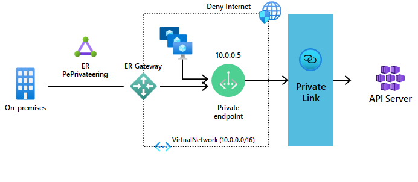

# Create AZURE AKS PRIVATE CLUSTER


[]

- Login AZURE Account
- Clone the Github Repo
- explain and execute the params.sh script 
- explain and execute the deploy_all.sh script 

- Once the Jump VM created then login to the VM and install the below to access the kubenetes cluster.

# install the Azure CLI.

- Get packages needed for the install process:

```
sudo apt-get update
sudo apt-get install ca-certificates curl apt-transport-https lsb-releas
```

- Download and install the Microsoft signing key:

```
curl -sL https://packages.microsoft.com/keys/microsoft.asc |
    gpg --dearmor |
    sudo tee /etc/apt/trusted.gpg.d/microsoft.gpg > /dev/null
```

- Add the Azure CLI software repository:

```
AZ_REPO=$(lsb_release -cs)
echo "deb [arch=amd64] https://packages.microsoft.com/repos/azure-cli/ $AZ_REPO main" |
    sudo tee /etc/apt/sources.list.d/azure-cli.list
```

- Update repository information and install the azure-cli package:

```
sudo apt-get update
sudo apt-get install azure-cli
```

# Install kubectl binary with curl on Linux

- Download the latest release with the command:

```
curl -LO "https://dl.k8s.io/release/$(curl -L -s https://dl.k8s.io/release/stable.txt)/bin/linux/amd64/kubectl"
```

- Validate the binary (optional)

- Download the kubectl checksum file:

```
curl -LO "https://dl.k8s.io/$(curl -L -s https://dl.k8s.io/release/stable.txt)/bin/linux/amd64/kubectl.sha256"
```

- Validate the kubectl binary against the checksum file:

```
echo "$(cat kubectl.sha256)  kubectl" | sha256sum --check
```

- Install kubectl

```
sudo install -o root -g root -m 0755 kubectl /usr/local/bin/kubectl
```

- integrate your azure account.Run the below command from Jump VM box

```
az login
```


# goto portal.azure.com --> go to kubernetes services

- open aks-private cluster resource

- click connect 

- run the commands [copy the commands and execute it from newly created jump box VM ]

```
az account set --subscription 477b79b8-2158-431e-a1eb-fd74972fbbce
az aks get-credentials --resource-group aks-private-rg --name aks-private
```

# access the kubernetes cluster

```
kubectl get nodes

```


- explain and execute the delete_all.sh script 